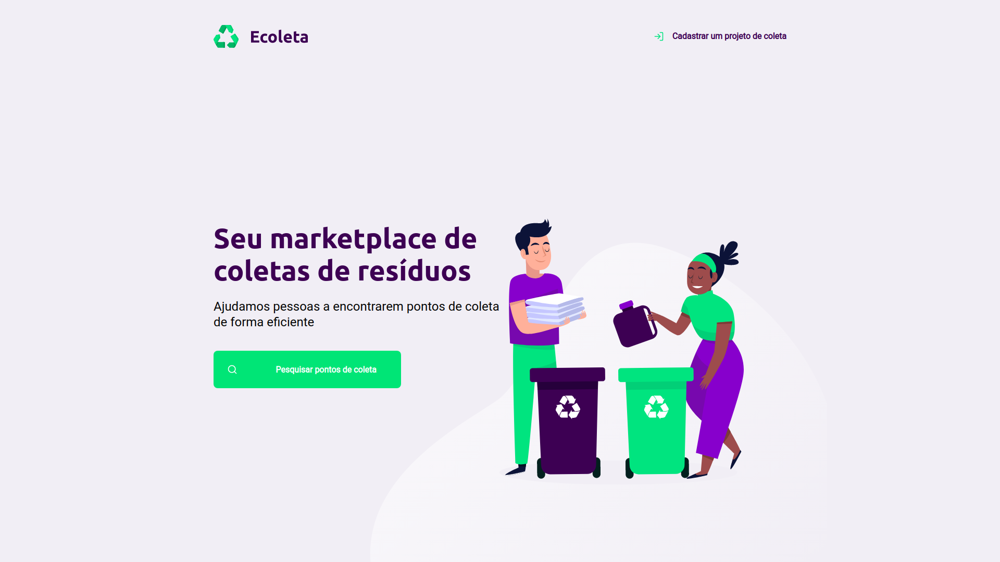
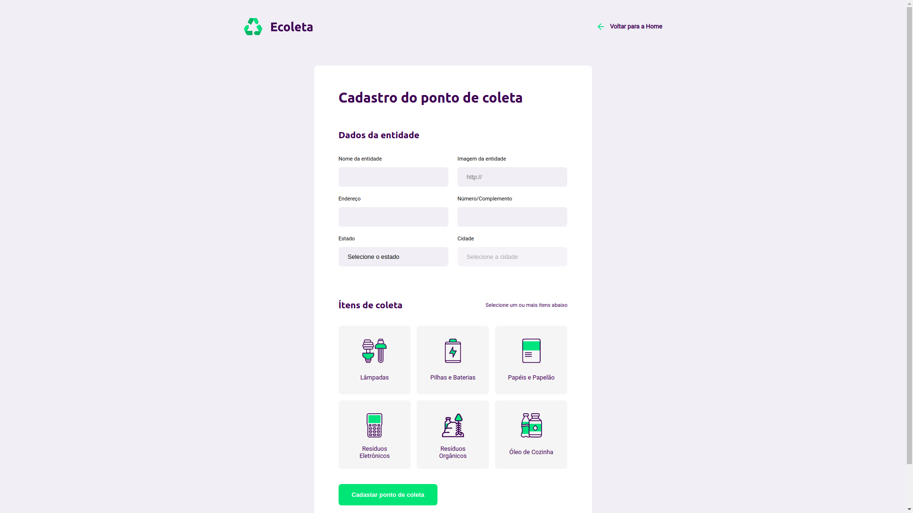
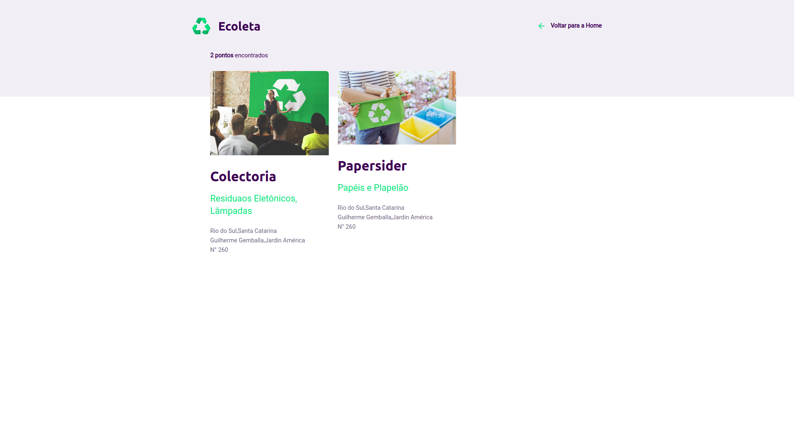

<h1 align="center">
    
</h1>

<h4 align="center"> 
	:construction: NextLevelWeek 1.0 🚀 In progress.. :construction:
</h4>

## :information_source: O que é o Next Level Week?
O NLW é uma semana prática com muito código, desafios, networking e um único objetivo: te levar para o próximo nível.

Através do nosso método você vai aprender novas ferramentas, conhecer novas tecnologias e descobrir hacks que vão impulsionar a sua carreira.

Um evento online e totalmente gratuito que vai te ajudar a dar o próximo passo na sua evolução como dev.
## 💻 :recycle:Project

### :recycle:ECOLETA

O projeto está sendo desenvolvido durante a semana do meio ambiente (01/05/2020 - 05/05/2020) e o tema do projeto é ecologia. 
Estamos desenvolvendo um site para cadastro de pontos de coleta de material reciclável e buscar pontos de coleta.

### Imagens do projeto
<div align="center">	
	




</div>

## 🤖 Tecnologias

#### Front-end:

- [Nunjucks](https://mozilla.github.io/nunjucks/)
    - [HTML 5](http://www.w3.org/TR/html5/)
    - [CSS 3](https://www.w3schools.com/Css/)
    - [JavaScript](https://www.javascript.com/)

#### Back-end:

- [NodeJS](https://nodejs.org/)
    - [Express](https://expressjs.com/)
    - [Nodemon](https://nodemon.io/)
- [SQLite3](https://www.sqlite.org/)

#### APIs

- [IBGE](https://servicodados.ibge.gov.br/api/docs/localidades?versao=1)

## :rocket:Uso

#### Instalar dependencias:
_com **npm**_
```bash
$ npm install
```
_com **yarn**_
```bash
$ yarn install
```

#### Iniciar servidor:

_com **npm**_
```bash
$ npm start
```
_com **yarn**_
```bash
$ yarn run start
```

> porta: 3000


## :memo: License

Este projeto está sob a  MIT license. [LICENSE](LICENSE.md).

Made with ♥ by Hellyson Ferreira :wave: [Get in touch!](https://hellyson-ferreira.github.io/hellysonferreira.github.io/)
